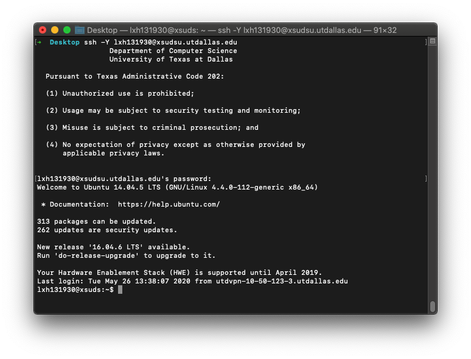
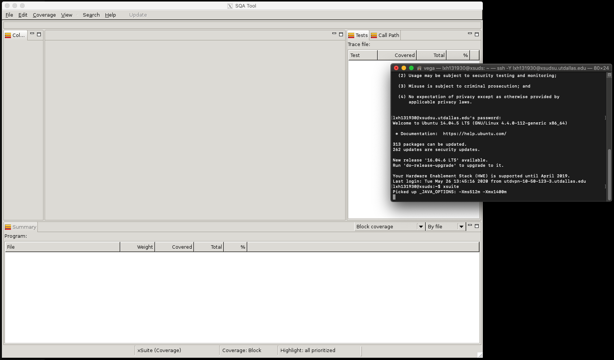

# Connect to our project server

Open your terminal.

Use ssh to connect to our server with -Y option:

    ssh -Y [Your NetID]@xsudsu.utdallas.edu

For example:

     ssh -Y lxh131930@xsudsu.utdallas.edu

Enter the initial password you got from my email, and you should be able to log in.

# Test xSuds tool suite

Once you successfully login to the server, test your X11 forwarding by running xsuite:

	xsuite
	
If everything is correct, you should be able to see the GUI of xsuite:

If you get many error messages, and you don't see the GUI of xsuite. Install [XQuartz](http://xquartz.macosforge.org/landing/), restart your Mac, and try again.

If you are still experiencing issues, please contact the TA.