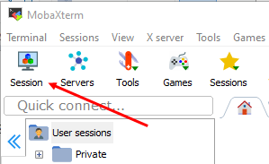
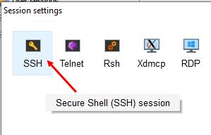
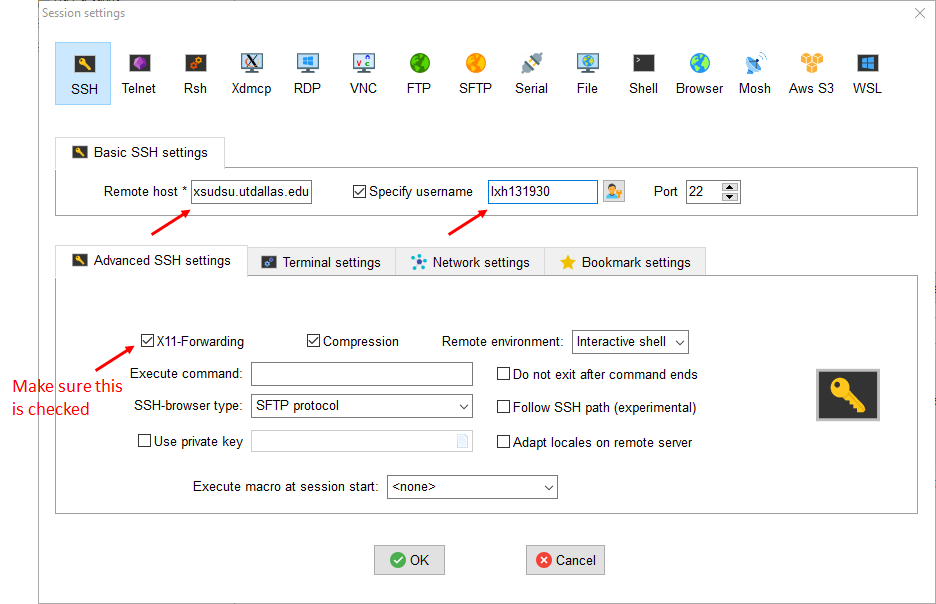
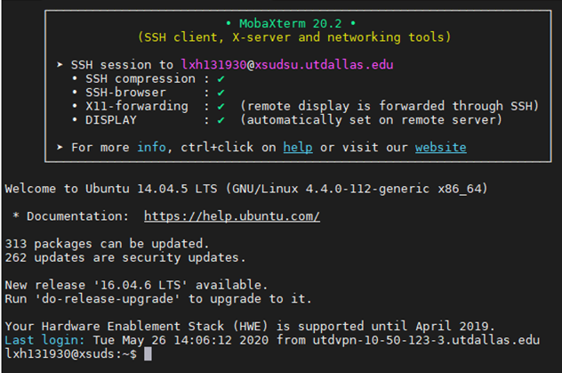
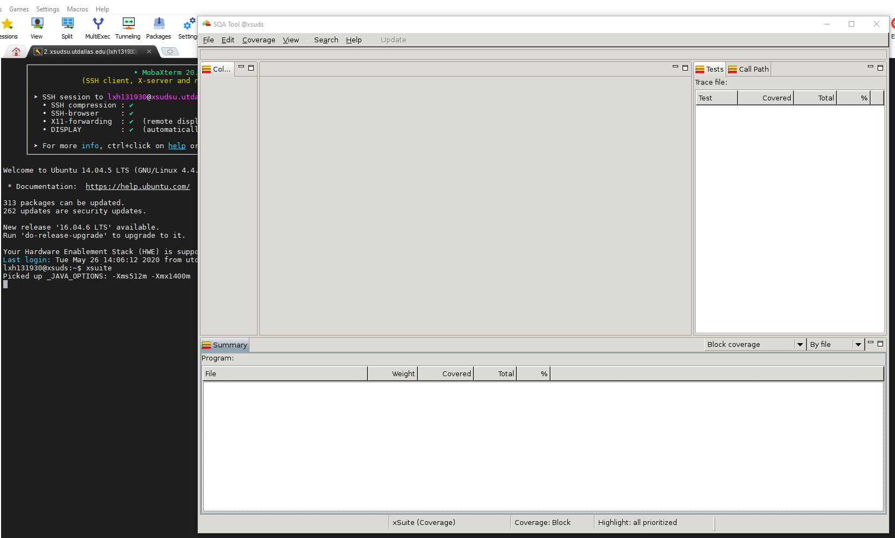

The following instructions are prepared using MobaXterm (a free software). Any tools that provide SSH and X11 forwarding should also work. However, we recommend using MobaXterm.

# Use MobaXterm to connect to the server

Download and install [MobaXterm](https://mobaxterm.mobatek.net/download.html). 

Run MobaXterm and create a new session.

Choose SSH for the session type.

Put ***xsudsu.utdallas.edu*** in ***Remote host***.  
Put your ***NetID*** in ***Specify username***.  
Check ***X11-Forwarding*** setting.

Click ***OK*** and double click that session you just created. Enter the initial password you received from the email. You should be able to log in to the server.

# Test xSuds tool suite (xsuite)

Once you successfully login to the server, test your X11 forwarding by running xsuite:

	xsuite
	
If everything is correct, you should be able to see the following GUI of xsuite:

If you have any issues, please contact the TA.